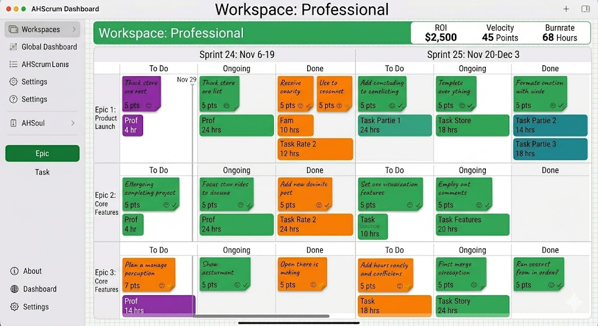
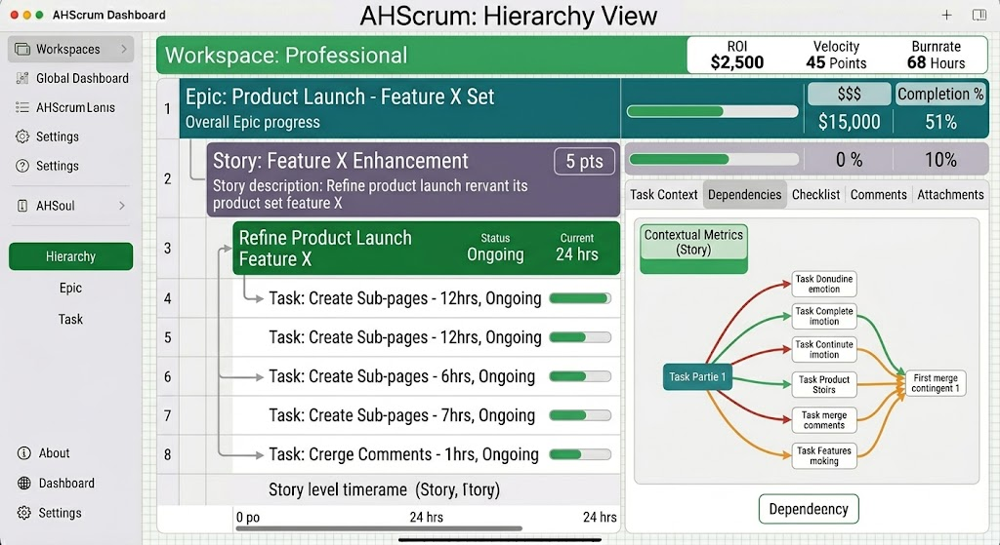
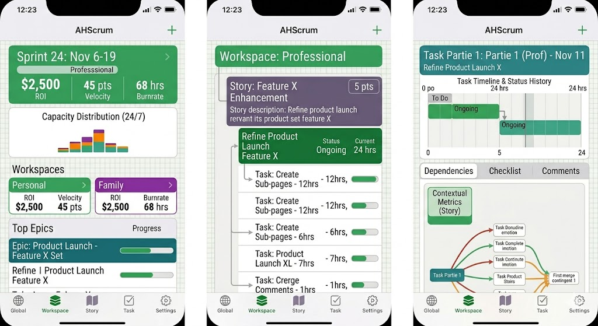

# AHScrum

Table Of Content:
 * [DESCRIPTION](#description)
 * [AGILITY SCRUM METHODOLOGY](#agility-scrum-methodology)

## DESCRIPTION
App to structure your Productivity, using Scrum Methodology
It is based on SwiftUI / SwiftData to run on iOS / MacOS.
We will provide a structure way to look at hierarchy of tasks.
Target is to prioritise based on different KPIs.

## AGILITY SCRUM METHODOLOGY

Components:
 * Task is the smallest work item I could perform. It should be scaled between 30m - 2h. And measure will be a burnrate, number of hours.
 * Story is the smallest grouping of task I could demo. It could span within half-day to 2 weeks (Sprint Duration). Measured by velocity, number of story points.
 * Epic is the smallest product item I could develop. Measured by the return on investment (roi) - How much would it cost me to buy instead instead of making it ?
* Sprint is a 2 wk fixed cadence to drive task, story and epic completion.
* Workspaces represent my focus areas, grouping of Epic by interrest (Personal, Professional, Family, etc ...)
 * Productivity is the ratio of ROI / burnrate.

## DASHBOARD

Workspace Dashboard summary view.

Story Dashboard with Epic / Sprint Planning view

Task Dashboard with Story, Epic Dependency view

Workspace, Story, Task Dashboard view for iOS